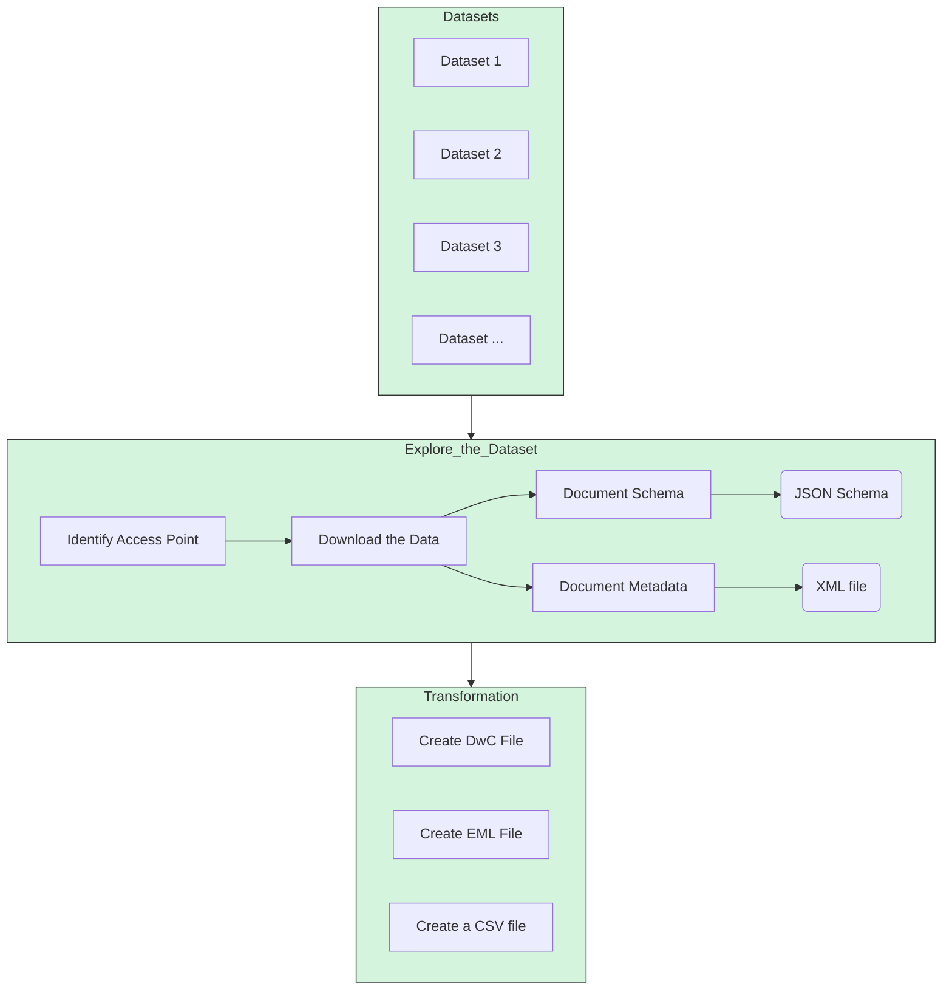

# Guidelines for general data processing flows

## Data 

### Describe the dataset.  

In a table (similar to what Ben has). Maybe create a clean template in excel to record the following information:

- Name of the dataset  
- Access point for download   
- Access method (API, HTTP server, manual, email, etc)   
- Point of contact: Name, Organisation, email address 
- ...

### Download the data an explore it 

- Verify and tabluate contains the minimum required fields:
    - (lat/lon)/geometry + CRS
    - timestamp
    - species
    - species encoding (one hot encoded, array delimited)
    - species taxon mapping to WoRMS
- Create a JSON file (preferable with a Python script) with the schema of the table (Tom to provide guidelines here)  
- Upload the data and the schema to someplace (S3? Onedrive folder? TBD)  

If the data is occurrences (or abundance or biomase or cover) of taxonomicaly identifiable species:  

- Create a code to produce a standard DwC table: 

    - Create a JSON(?) dictionary to translate the actual table schema into DwC schema  
    - Create a Python code to produce the DwC file  

 

## Metadata 

Ideally we should collect all the required metadata info to be able to create a DwC metadata record (if occurrences) and/or a standard iso19115 record for the AODN Geoetwork 

- Extract, programmatically if possible (yes, in the case of a geoserver) the metadata records  
- Record the metadata into  a JSON file  

For the occurrence (DwC) data, create the corresponding EML (XML) file. Need a template for this with the mandatory fields. See the EML in the [OBIS manual](https://manual.obis.org/eml)

## flowchart

